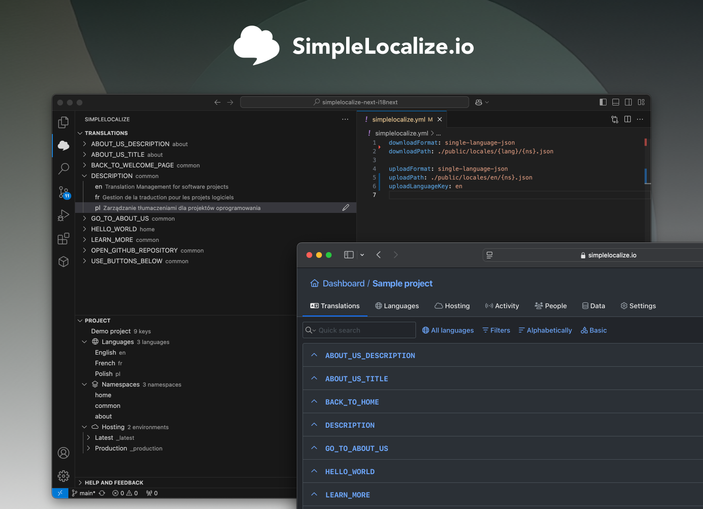
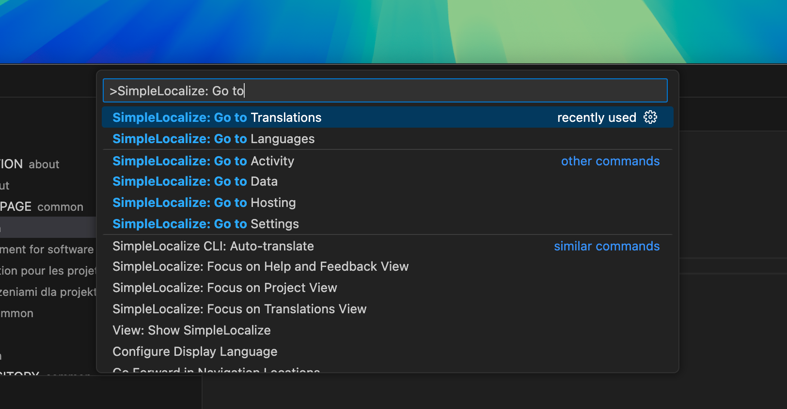
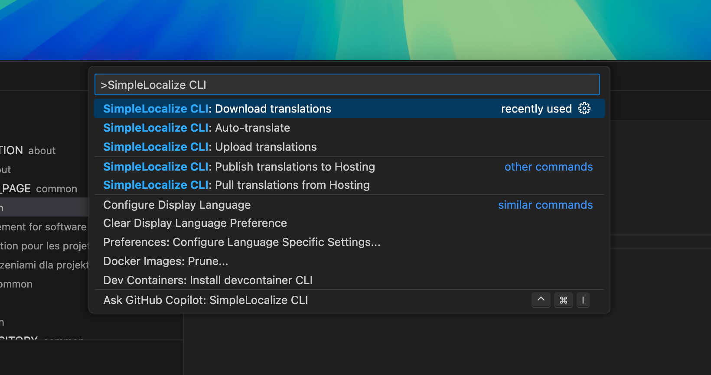

# SimpleLocalize VS Code Extension

[SimpleLocalize](https://simplelocalize.io) VSC Extension is a tool designed to manage translations within your Visual Studio Code environment. With this extension, you can easily integrate SimpleLocalize, a user-friendly app for managing translations, directly into your development workflow. This extension simplifies the localization process, allowing you to focus on writing code while ensuring your application is accessible to a global audience.

https://github.com/user-attachments/assets/46982b7d-3f38-406f-9dcf-8ae3720a6598

## Features

Here is a short description of all available features:

- **Translations Management**: Easily edit, delete, and copy translation keys directly from the sidebar.
- **Project Details**: View project statistics, languages, namespaces, and translation hosting resources.
- **Code Actions**: Create, convert, update, and rename translation keys from selected text in your code.
- **Code Completion**: Get intelligent suggestions for translation keys as you type.
- **Open in Web UI**: Quick access to various tabs of your SimpleLocalize project in the web UI.
- **CLI Integration**: Execute common SimpleLocalize CLI commands from the Command Palette.

These features streamline the localization process, making it easier to manage translations within your development workflow.

### Sidebar

Sidebar has 4 sections:

#### Translations

Translations section is a tree of your project content. List of translation keys and translations. You can here edit translation keys and translation.

https://github.com/user-attachments/assets/d4f9b9d0-9f27-4532-897c-10cf9d721c80

Functions:

- **Delete keys** - select one or more translation keys and click "cmd + backspace" to delete keys,
- **Copy translation key** - select one or more translation keys and click "cmd+c" to copy the key,
- **Translation key context menu** - right click on the translation key to see more options like "Change namespace", "Open in Web UI",

#### Project details

Project section shows you the basics of your project like number of translation keys, list of languages, namespaces, customers, and [translation hosting](https://simplelocalize.io/translation-hosting/) resources split by environment with option to preview every resource.

https://github.com/user-attachments/assets/63587d63-9116-4b01-9d42-5baae7088d37

#### Recent activity

Recent activity show last 10 activity entries for the configured project, with some basic details like type, is it running, and when the activity occurred.

#### Help and Feedback

This section provides an option to configure the extension to suit your needs. You can set up your personal token and project details to ensure seamless integration with SimpleLocalize.

### Code Actions

Extension provides several code actions:

- **Create translation key from selected text**

https://github.com/user-attachments/assets/4a0a831e-68fc-4b3a-9e7c-abf97074ccf1

- **Convert selected text into translation key**

https://github.com/user-attachments/assets/d69a9e62-c63f-4f7f-8896-29fce713687e

- **Update translation with selected text**

https://github.com/user-attachments/assets/5998ac72-8f75-416b-97b2-b0c64a7f723f

- **Rename translation key from selected text**

https://github.com/user-attachments/assets/523da146-0748-4c1b-9c64-71b50ac1f971

### Translation keys competition

Extension suggests translation keys directly in your code. As you type, the extension will provide intelligent suggestions for existing translation keys, making it easier to maintain consistency and avoid typos.

https://github.com/user-attachments/assets/ed9640af-2631-461d-9798-6e3ecb43c9dc

### Open in Web UI

We've added a several quick actions to get access to some tabs of the configured project in the SimpleLocalize Web UI:

- **Open Translations**: Opens the Translations tab,
- **Open Languages**: Opens the Languages tab,
- **Open Hosting**: Opens the Hosting tab,
- **Open Activity**: Opens the Activity tab,
- **Open Data**: Opens the Data tab,
- **Open Settings**: Opens the Settings tab.

### SimpleLocalize CLI integration

CLI integration adds the most common commands to your Command Palette. Commends don’t run automatically, they open a prepared command in the SimpleLocalize terminal. Such an approach allows developers to review the command before running it.

- **Download translations**
- **Upload translations**
- **Auto-translate**
- **Hosting: Publish translations**
- **Hosting: Pull translations**

https://github.com/user-attachments/assets/177f6a69-4cce-4ca2-91a4-93276cd2ce89

> The extension requires to have [SimpleLocalize CLI](https://simplelocalize.io/command-line-tool/) installed on your machine.

## Requirements

Integrations doesn't require any additional software to work, however some features like downloading translations, uploading translation,
and auto-translation requires [SimpleLocalize CLI](https://simplelocalize.io/command-line-tool/) to work. It's recommended
to have the CLI installed to use the full potential of the extension and simplify the whole process of managing your translation files and strings.

## Extension configuration

Open "SimpleLocalize" sidebar on the left side, go to "Help & Feedback" and click "Configure extension". 
[Generate a personal token](https://simplelocalize.io/dashboard/security/) in SimpleLocalize, and choose option to configure the token, later choose a project. Now, your extension is ready to use.

## Contribution

Contributions are welcome! You can contribute in the following ways:

- **Pull Requests**: We welcome pull requests for new features, bug fixes, and improvements.
- **Feature Ideas**: Have an idea for a new feature? Open an issue to discuss it with us.
- **Bug Reports**: Found a bug? Please report it by opening an issue.

We appreciate your help in making this extension better!

## License

This extension is licensed under the MIT License.

## Release Notes

Users appreciate release notes as you update your extension.

### 1.0.X

Initial release of SimpleLocalize VSC Extension

### 1.1.X

- Added option to auto-translate project
- Added option to publish translations
- Added recent activity
- Added showing tags and descriptions
